# Professional Skills Training: Lifecycle Automation

A certification course business sells seats, collects a signed participation agreement from each
student, releases the course material, and issues a CE certificate once they attend. Every one of
those steps normally means somebody watching an inbox, updating a spreadsheet, and remembering to
follow up.

This system does it instead. One Airtable board holds one row per person, one column per stage. Six
of the nine n8n workflows move a row forward when something real happens: an inquiry submitted, an
order completed, an agreement signed, a call logged, attendance confirmed. Two are supporting paths
that deliberately advance no one, reissuing an expired signing link and resending a certificate on
request. The ninth watches the other eight and reports any failure.

Along the way the system sends the signing link, holds course access until the agreement is
genuinely signed, generates a personalized certificate from a Google Slides template, and tells the
team in Slack. Nothing advances by hand except where a person genuinely decides something: following
up, correcting a mistake, approving a refund.

**The engineering is the point.** Duplicate webhooks, replayed events, forged requests and silent
failures are what break automations in production, and each has a specific defense here: idempotency
guards, HMAC and token verification on every inbound trigger, and a shared error alerting workflow
behind all nine. Every claim below is backed by a genuine live test, not a synthetic payload.

This is a portfolio/demonstration project. See [About This Project](#about-this-project) for scope
and what's real vs. illustrative.

**Contents:** [The Lifecycle](#the-lifecycle) · [Tech Stack](#tech-stack) ·
[The Workflows](#the-workflows) · [Proof It Actually Works](#proof-it-actually-works) ·
[Built to Be Re Skinned](#built-to-be-re-skinned) · [Security Highlights](#security-highlights) ·
[Deep Dive Write ups](#deep-dive-write-ups) · [About This Project](#about-this-project) ·
[License](#license) · [Contact](#contact)

## The Lifecycle

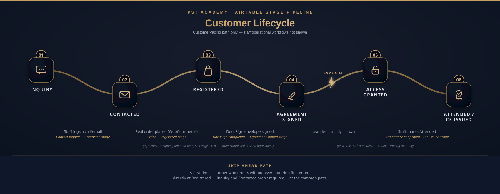

## Tech Stack

| Layer | Tool | Role |
|---|---|---|
| Orchestration | n8n (Docker) | Runs all 9 real workflows across the customer lifecycle |
| Database / CRM | Airtable | Stage based Kanban board, linked Contact Log, idempotency ledger |
| Storefront | WordPress + WooCommerce | Real 3 tier variable product, order/checkout events, Stripe for payment |
| Inquiry form | WPForms | Pre sale questions, starts the lifecycle at Inquiry |
| E signature | DocuSign (sandbox) | Real envelope creation and signature completion detection |
| Team notifications | Slack | 6 channels: 5 business, plus a dedicated `#alerts` channel for operational failures |
| Customer/staff email | Gmail (n8n native node, OAuth) | Confirmations, signing links, certificates |
| Site email | Resend (sandbox), via WP Mail SMTP | WooCommerce's own native order emails, a separate path from n8n's Gmail notifications |
| Certificates | Google Slides + Google Drive | Template merge, PDF export, storage and delivery |

**Why n8n, not Make.** The build started on Make and moved to n8n once Make's free tier hit its
2 active scenario cap mid build. Self hosted n8n runs at $0 with no scenario limit, and it fits a
security first approach better than a SaaS platform holding the credentials. A frozen Make version
still exists in parallel, for clients whose team already prefers Make.

## The Workflows

9 real n8n workflows, in lifecycle order. Each canvas screenshot shows the actual node graph and
sticky note documentation, not a simplified diagram. Real bugs found along the way are covered in
the deep dive write ups below, not repeated here.

**[PST] Inquiry → Inquiry stage**
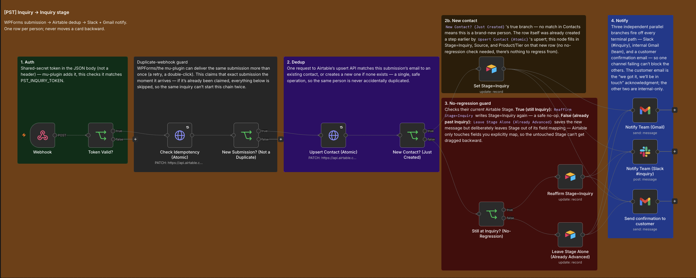
WPForms webhook, shared secret token check, idempotency claim, three independent parallel notify
branches.

**[PST] Contact logged → Contacted stage**
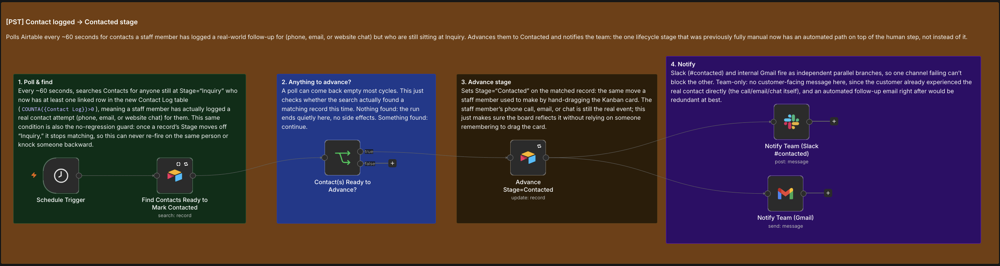
A 60 second poller. Advances Stage the moment staff logs a Contact Log entry against an Inquiry-
stage contact. The no regression guard is just the search filter itself: a record leaves the
match the instant it advances, so it can't re fire.

**[PST] Order → Registered stage**
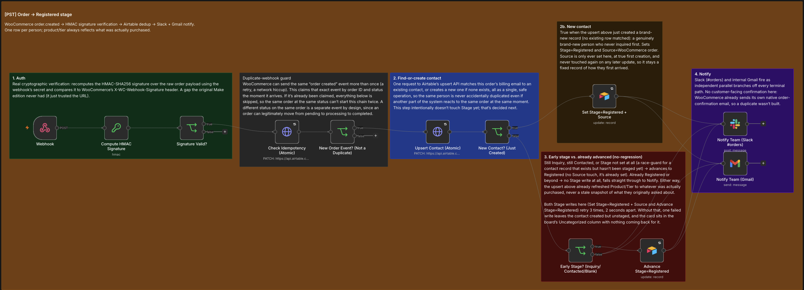
HMAC verified WooCommerce webhook that creates or updates the Airtable contact and advances Stage
to Registered.

**[PST] Order completed → Send agreement**
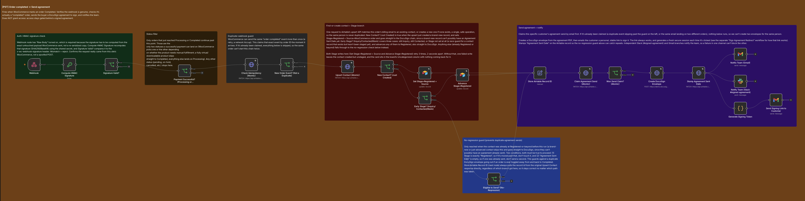
Creates a real DocuSign envelope from the agreement PDF and emails the customer a signing link
carrying an HMAC signed, time limited token.

**[PST] Sign Agreement Redirect**
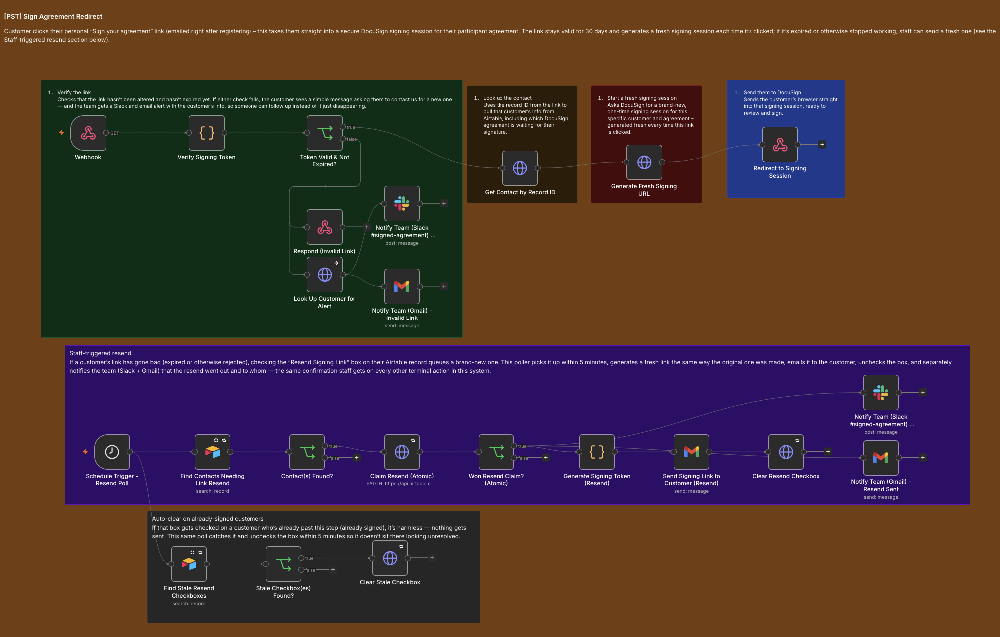
Verifies the signing link token with a constant time comparison (`crypto.timingSafeEqual`), then
generates a brand new one time DocuSign session and redirects the customer straight into it. Also
handles link resends: a 5 minute poller watches for a staff checked "Resend Signing Link" box on
Airtable, claims it atomically, generates a fresh link through the same path as the original, and
emails it, plus a separate cleanup poller that quietly unchecks that same box if it's ever checked
on a customer who's already signed. Harmless, but it shouldn't sit there looking unresolved.

**[PST] DocuSign completed → Agreement signed stage**
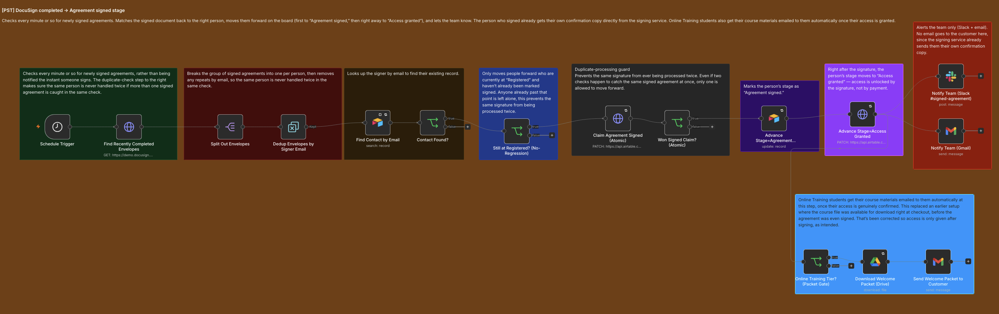
Polls for completed envelopes. Advances Stage to Agreement signed and cascades straight into
Access granted in the same automated step, no real contact ever rests at "Agreement signed" for
any duration. Sends the Welcome Packet for the Online Training tier.

**[PST] Attendance confirmed → CE issued stage**
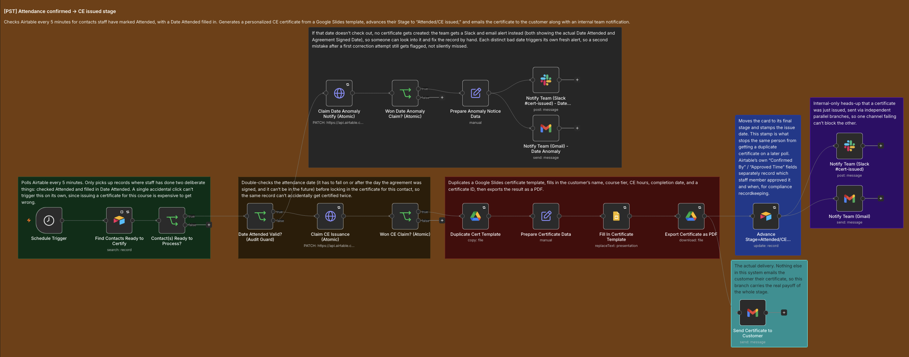
Triggered by a deliberate staff action: marking a contact Attended and entering a Date Attended,
both required before the poller picks the record up. Generates a real certificate via Google Slides
merge, guarded against a Date Attended that falls before the agreement signature or in the future.

**[PST] Resend Certificate**
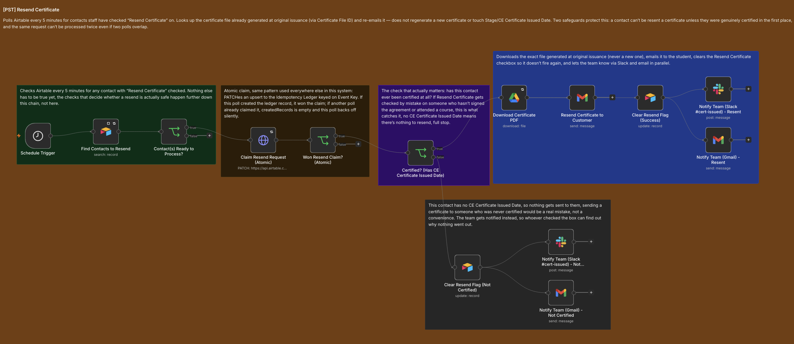
Staff utility, not a lifecycle stage. Lets a certificate that was already issued be resent via an Airtable
checkbox, guarded against resending to a contact who was never actually certified.

**[PST] Workflow failure → Alert team**
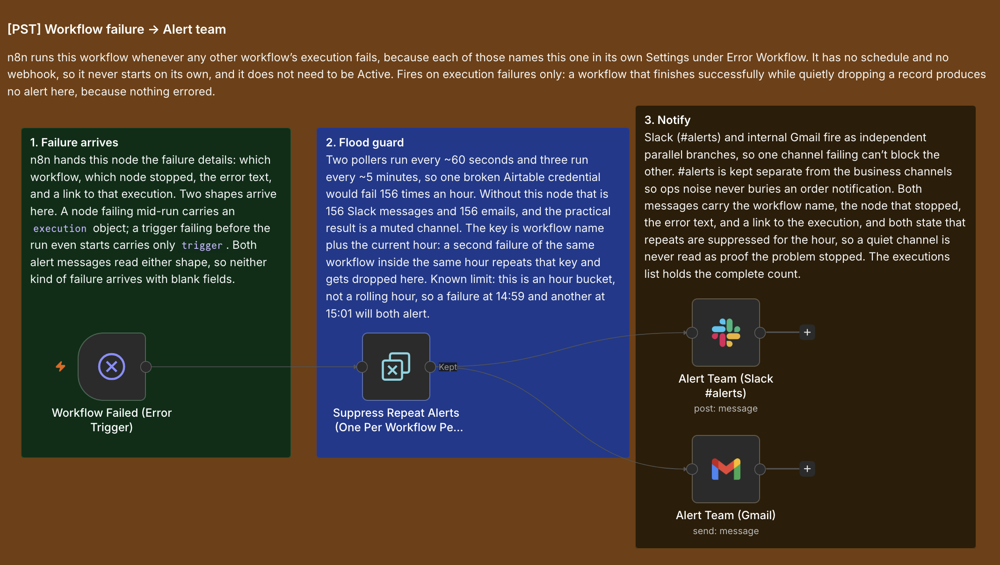
The shared error handler for every other workflow. Hourly bucketed alert suppression so one broken
credential doesn't produce hundreds of duplicate pages. Verified against a genuine credential
outage: 26 real failures over ~5.5 minutes produced exactly 6 Slack alerts and 6 emails, none
dropped.

## Proof It Actually Works

**Real execution trace**, order #121 through real checkout, not a replay:
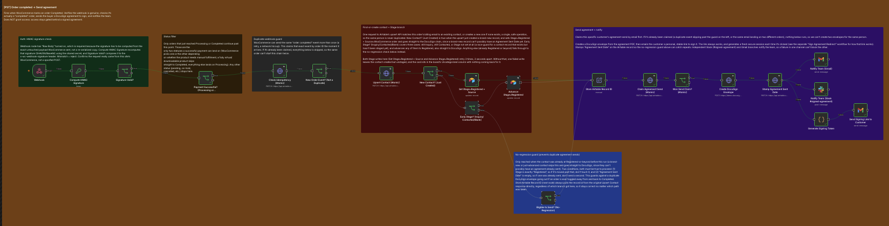

**The operational board**, Airtable Kanban view staff actually use:
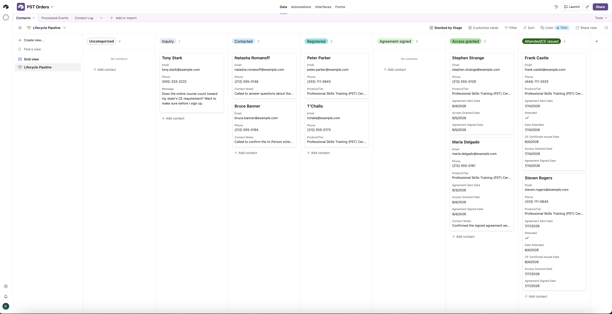

**A real issued certificate**, the tangible output at the end of the lifecycle:
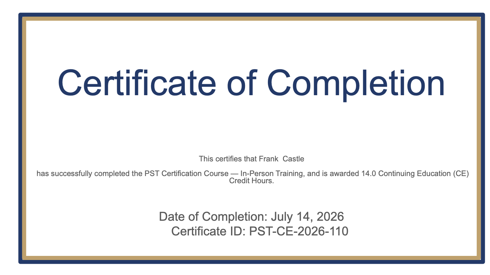

**The storefront product**, where the whole lifecycle begins:

## Built to Be Re Skinned

The automation is driven by a generic `Stage` field on the Airtable Contacts table (Inquiry,
Contacted, Registered, Agreement signed, Access granted, Attended/CE issued), plain
business process labels that fit any inquiry to fulfillment flow. The trigger, guard, and notify
logic never reference a specific product or course; that only lives in the product name and email
copy, the content layer, not the automation layer.

Every workflow follows the same proven chain regardless of what it's automating: verify the
trigger (shared secret token or HMAC signature) → claim an idempotency lock so retries and
duplicate deliveries can't double process → upsert the contact → advance the Stage, only forward,
never backward → fan out to team notifications in parallel, so one broken channel can't block the
others. That pattern is documented once and reused across every stage, not reinvented per
workflow.

The specific timings are settings, not fixed architecture. The polling workflows run on 60s
(`Contact logged → Contacted stage`), ~60 to 90s (`DocuSign completed → Agreement signed stage`), or
5 minute (`Attendance confirmed → CE issued stage`, `Resend Certificate`) Schedule Triggers, and
the alert workflow's duplicate suppression window is a separate 1 hour clock bucket. All of these
are single configuration values, not hardcoded assumptions, tuned to whatever polling cadence and
alert noise tolerance an actual deployment needs.

**What actually swaps for a different business:** the WooCommerce product and tiers, the DocuSign
agreement template, the Google Slides certificate template, and the copy in every customer facing
email. **What doesn't change:** the Stage progression, the trigger/guard/notify pattern, and the
security model underneath it. Re skinning this for a different certification based business is
real work, new product setup, new templates, but it's content work, not a rebuild of the
automation itself.

The naming reflects this on purpose: PST stands for "Professional Skills Training," an
industry agnostic label that fits certification based training in general.

## Security Highlights

Every inbound trigger is verified before anything else runs. WooCommerce webhooks
(`Order → Registered stage`, `Order completed → Send agreement`) check an HMAC signature against
the payload before the workflow does anything with it. The inquiry webhook checks a shared secret
token in the request body. Signing links carry their own HMAC signed, time limited token, verified
with a constant time comparison (`crypto.timingSafeEqual`) before anyone gets redirected into the
DocuSign session.

This system uses the constant time version for one specific check: the signing link token, before
someone is let into the DocuSign session. That check runs as real code, since constant time
comparison isn't something you can build with n8n's drag and drop nodes, only actual code can do
it. The WooCommerce webhook signature check, by contrast, still runs inside a plain visual node, a
simple equality check, not constant time, and that same check exists twice, once in
`Order → Registered stage` and once in `Order completed → Send agreement`, since each workflow has
its own independent copy. That split was a deliberate decision, not an oversight: fixing it would
mean replacing both visual nodes with custom code and retesting both signature paths, valid and
forged, on each, real added complexity, for a risk that's close to zero on a demo with no real
money or customer data on the line. For a real client, that same work still has to be done twice,
but it's worth it: real orders and real customer data raise the risk enough to justify it, and
it's not starting from a blank page either, n8n's Code nodes can't import each other, so it means
adapting the constant time pattern already proven in the signing link check, not solving a new
problem from scratch.

Secrets never live in git. The two shared secret tokens are read from a gitignored `.env` file at
runtime; every third party credential (Airtable, Slack, Gmail, DocuSign) lives in n8n's own
encrypted credential store, never in an exported workflow file, and no workflow JSON is part of
this public repo at all.

Two more fixes worth naming: n8n's Docker port binding was corrected from exposing the admin UI
and API to the whole local network down to loopback only, closing a real LAN reachable credential
surface. And the API access used to help assemble this repo was scoped to read/list/update on
workflows only, no credential or execution access, confirmed the hard way when those scopes
returned `Forbidden`.

## Deep Dive Write ups

Two full write ups go beyond this README:

- **[Client Handoff Walkthrough](https://tndevproj.github.io/professional-skills-training-automation/HANDOFF-lifecycle-explained.html)** ([PDF](docs/HANDOFF-lifecycle-explained.pdf)). The customer lifecycle explained through a real walkthrough, not a flowchart.
- **[Challenges, Fixes & Security](https://tndevproj.github.io/professional-skills-training-automation/challenges-fixes-security-writeup.html)** ([PDF](docs/challenges-fixes-security-writeup.pdf)). The real bugs found, how they were diagnosed, and the security hardening applied.

## About This Project

This is a demonstration project, built to show a real, working automation system end to end, not
a real, currently operating business. It isn't affiliated with, endorsed by, or representing any
real company.

The certification course, product tiers, and customer/staff activity shown throughout this repo
are illustrative. Some of it reflects genuine test activity, real WooCommerce orders, real
DocuSign envelopes and signatures, real webhook triggers, used to prove the automation actually
works end to end rather than just being designed on paper. The rest is deliberately fictional demo
data, standing in for real customer information that was cleared out before anything went public.

The whole system runs on a local development environment (WordPress via MAMP, n8n via Docker),
not a public deployment. Any `localhost` URLs visible in the screenshots aren't reachable from
outside that machine.

A few security and configuration choices reflect what's reasonable for a local demo specifically,
not a finished production checklist; where that's the case, it's called out directly in the
Security Highlights section above, along with what would actually change for a real client
deployment.

## License

All rights reserved. See [LICENSE](LICENSE). This repository is a portfolio piece, not licensed
for reuse.

## Contact

**Tony Ngo**, AI Automation Specialist, [Avyxen LLC](https://avyxen.com)

Open to automation engineering roles and client work. Reach me at
[tony@avyxen.com](mailto:tony@avyxen.com).
